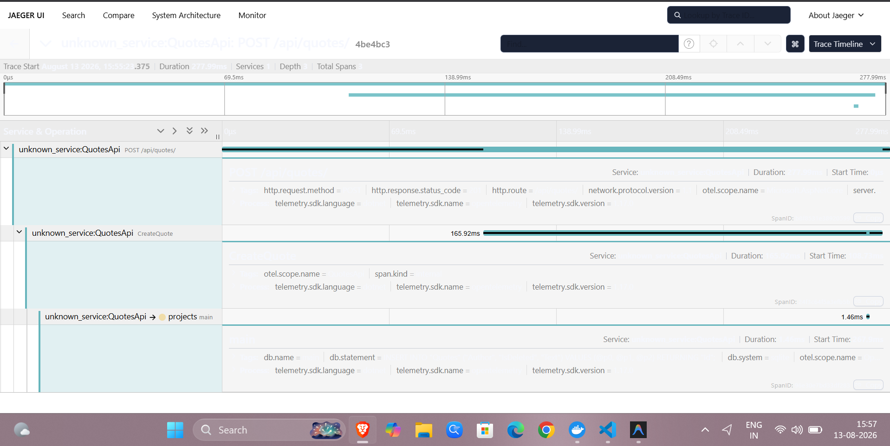

# Day 4 Task 5 - OpenTelemetry Tracing

This directory contains the proof of nested OpenTelemetry spans captured by Jaeger for the `QuotesApi` during an authenticated `POST /api/quotes` request.

## Jaeger Trace Output

