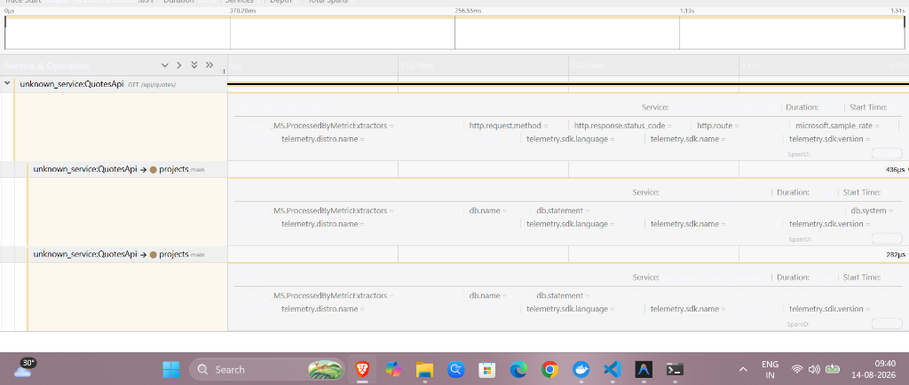
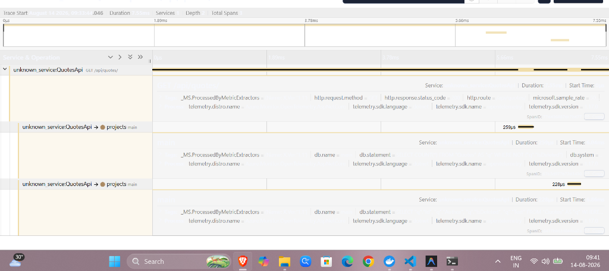

# Day 5 Task 1: Diagnose a Slow Endpoint

## Task Objective
The goal of this task was to diagnose a slow endpoint using OpenTelemetry traces and identify the root cause of the performance bottleneck.

## Intentional Degradation
To simulate a performance issue, we intentionally degraded the `GET /api/quotes` endpoint by injecting `Thread.Sleep(1500);` into the handler in `ProgramExtensions.cs`.

## Original Slow Trace Diagnosis
Using Jaeger, we captured a trace of the degraded endpoint:
- **TraceId:** `1e05b656c0592e7f04b7ad7f141e03aa`
- **Total Duration:** ~1.513 seconds

### Why the Database Was Not the Bottleneck
The trace revealed that the root span (`GET /api/quotes/`) accounted for the entire 1.513s duration. However, its EF Core child spans (named `main`, representing the SQLite database queries) were extremely fast, taking only `~0.4 ms` and `~0.2 ms`. Because the database queries executed almost instantaneously, the trace proved that the bottleneck was entirely contained within the application code of the API handler itself.

## The Fix
We resolved the performance bottleneck by removing the `Thread.Sleep(1500);` statement from the endpoint delegate.

## Verification
After applying the fix, we verified the performance improvement with a new trace in Jaeger:
- **New TraceId:** `d237ca45ebd7a86335f6189e4499915e`
- **Before Duration:** ~1.513 seconds
- **After Duration:** ~7.55 milliseconds (7550 microseconds)

The delay was completely eliminated, restoring the endpoint's expected performance.

## Trace Evidence
The traces were viewed and verified using a local Jaeger container (`jaegertracing/all-in-one:latest`) listening on the default OTLP ports (`4317`/`4318`). The `QuotesApi` seamlessly exported its telemetry data to this local instance, allowing us to inspect the span hierarchy and duration timings through the Jaeger UI.

### Before — Slow Trace

### After — Fixed Trace

