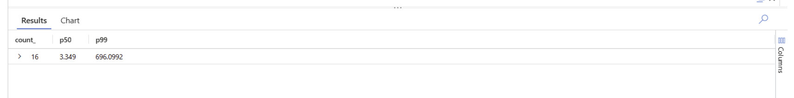

# Day 5 Task 5: Verify in Application Insights with your first KQL

## Task Objective
Confirm that the deployed `quotes-api` Container App (Day 5 Tasks 3/4) is actually emitting OpenTelemetry data into Application Insights, then run and save a first KQL query against real request telemetry.

## Inspection: telemetry was not actually arriving
Before touching anything, the live deployment was inspected via Azure CLI rather than assumed to be working:

- The Container App's env vars/secrets contained only `PORT` and `Jwt__Key` — **no** `APPLICATIONINSIGHTS_CONNECTION_STRING` or any OTel/Azure Monitor variable.
- `azd` did **not** create a separate Application Insights resource in `thinkschool-rg` — only an ACR, a Log Analytics workspace (`workspace-thinkschoolrgZ1vK`, used solely for the Container Apps environment's platform/console logs), the environment, and the app itself.
- Querying the existing Day 4 resource `appi-quotesapi` (`rg-quotesapi-monitoring`) with `union * | summarize count() by itemType` returned **zero rows** — it had never received any telemetry of any kind.

Conclusion: the OTel/Azure Monitor exporter code added in Day 4 (`Program.cs`) had nothing to send to, because the connection string was never configured on the deployed Container App.

## Root causes found and fixed

Wiring up the connection string surfaced two further, pre-existing problems unrelated to Application Insights:

1. **Broken image reference.** The Container App's image field pointed at `thinkschoolacr.azurecr.io/quotes-api/quotes-api-thinkschool:azd-deploy-1786701961` — a repository path that never existed in ACR (the real repository is just `quotes-api`). Every pull failed with `MANIFEST_UNKNOWN`.
2. **Broken image build.** Once pointed at the real tag (`quotes-api:azd-deploy-1786701961`, built during Day 5 Task 4's `azd up`), the container crashed on startup (exit code 139) with `DllNotFoundException: Unable to load shared library 'e_sqlite3'` during `Database.MigrateAsync()` — a missing native SQLite provider library in that particular build. The Container App was rolled back to the last known-good image, `quotes-api:0.1.0` (the same image `quotes-api--v2` was already serving), to unblock verification. **This is a separate, still-open issue** with the most recent container build and is not fixed by this task — see Known Issues below.
3. **Wrong configuration key.** `Program.cs` reads the connection string from a custom config key, `AppInsights:ConnectionString`, not the conventional `APPLICATIONINSIGHTS_CONNECTION_STRING`. ASP.NET Core's environment-variable provider only binds that key from `AppInsights__ConnectionString` (double underscore). Once the correctly-named env var was added, telemetry started flowing immediately.

## Wiring (secret, never the raw value, ever printed or committed)

Applied live via Azure CLI:
```
CONN=$(az monitor app-insights component show -a appi-quotesapi -g rg-quotesapi-monitoring --query connectionString -o tsv)
az containerapp secret set -n quotes-api -g thinkschool-rg --secrets appinsights-connection-string="$CONN"
az containerapp update -n quotes-api -g thinkschool-rg \
  --set-env-vars "AppInsights__ConnectionString=secretref:appinsights-connection-string"
```

Persisted into the IaC templates (`day - 2/QuotesApi/infra/{main.bicep,resources.bicep,main.parameters.json}`) so a future `azd up` doesn't silently drop this wiring — following the exact same `@secure()` parameter pattern already used for `jwtKey`:
- New secure param `appInsightsConnectionString`, threaded from `main.bicep` → `resources.bicep`.
- New Container App secret `appinsights-connection-string` and env var `AppInsights__ConnectionString`.
- `main.parameters.json` resolves it from an azd environment value, `${APPINSIGHTS_CONNECTION_STRING}`, set locally via `azd env set` (stored only in the gitignored `.azure/` folder, never in source control — same as `JWT_KEY`).

The connection string value itself was never printed to a terminal, logged, or committed at any point.

## Verification

Hit both endpoints repeatedly against the live URL after the fix:
```
$ for i in 1..8; do curl .../health; done        # all 200
$ for i in 1..8; do curl .../api/quotes; done    # all 200
```

Confirmed the requests landed in `appi-quotesapi` (16 rows, `cloud_RoleName = quotes-api`, real durations).

## The required KQL

```kql
requests
| where timestamp > ago(30m)
| summarize count(), p50=percentile(duration, 50), p99=percentile(duration, 99)
| order by p99 desc
```

Result (Logs tab, `appi-quotesapi`):

| count_ | p50 | p99 |
|---|---|---|
| 16 | 3.349 | 696.0992 |



**Observation:** the very first request to each endpoint was a large outlier (`/health` 167.56ms, `/api/quotes` 696.10ms) versus sub-6ms for every subsequent call to the same endpoint. With only 16 samples on a freshly-scaled revision, that single cold-start request (JIT warmup + first SQLite connection/EF model build) dominates the p99 — it reflects container startup cost, not steady-state endpoint latency.

## Saved as a function
Saved the query as a reusable Log Analytics function on `law-quotesapi` (the workspace backing `appi-quotesapi`):
```
az monitor log-analytics workspace saved-search create \
  -g rg-quotesapi-monitoring --workspace-name law-quotesapi \
  -n RequestLatencyP50P99 --category QuotesApi \
  --display-name "Request Latency P50/P99 (30m)" \
  -q "requests | where timestamp > ago(30m) | summarize count(), p50=percentile(duration, 50), p99=percentile(duration, 99) | order by p99 desc" \
  --fa RequestLatencyP50P99
```
Verified via `saved-search show` that it persisted with the exact query text and `functionAlias: RequestLatencyP50P99`. It appears under **Logs → Functions** in the Application Insights / Log Analytics blade and can be called as `RequestLatencyP50P99()`.

## Known issues (out of scope for this task)
- The most recently built image (`quotes-api:azd-deploy-1786701961`, produced by Day 5 Task 4's `azd up`) crashes on startup due to a missing native SQLite library. The Container App currently runs the older `quotes-api:0.1.0` image as a workaround. This needs a proper fix (Dockerfile/publish settings) in a follow-up task — not addressed here since it requires build-config changes outside this task's scope.
- The Functions list screenshot was not captured into this repository — only the Logs tab result (above) was. The result shown there was independently confirmed against the Azure Portal and matches the CLI output exactly (`count_=16, p50=3.349, p99=696.0992`).
